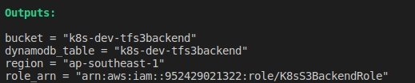

# Use Terraform and Ansible to deploy a Kubernetes cluster automatically

## 1. Create S3 bucket for Terraform backend

Your local machine should pre-installed:

- Terraform
- AWS CLI

Move to the folder [s3-backend](./s3-backend), change this part to your local information.

```sh
provider "aws" {
  region                    = var.region
  shared_config_files       = ["/home/dungpham/.aws/config"]
  shared_credentials_files  = ["/home/dungpham/.aws/credentials"]
  profile                   = "default"
}
```

**`Note: you only need to run this once at beginning.`**

Run below commands to create a S3 bucket for Terraform state.

```sh
# Move to the folder s3-backend
cd s3-backend

# Init terraform
terraform init

# Check resource changes
terraform plan

# Apply terraform code
terraform apply
```

The result look like this.

